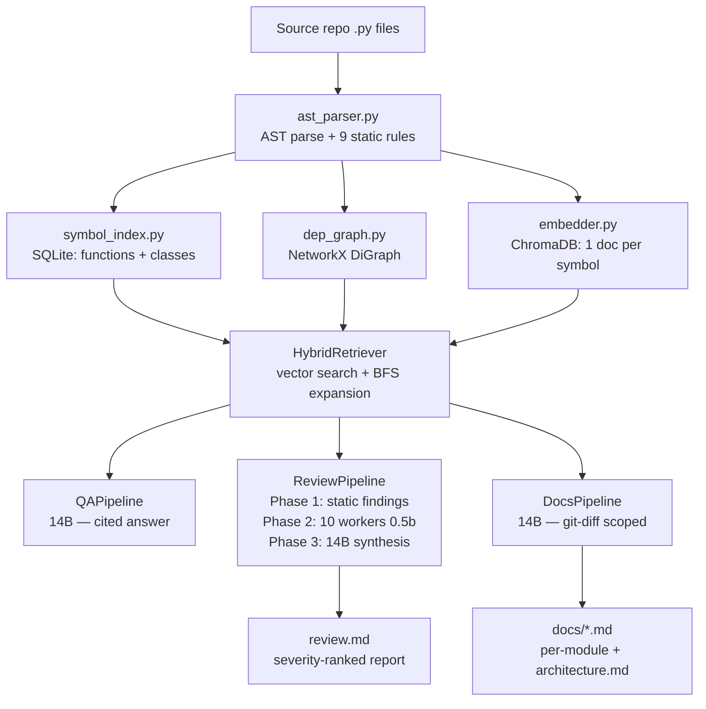

# Code-Sentinel

**A fully local, multi-agent AI system for automated code review, Q&A, and incremental documentation — runs entirely on consumer hardware, zero data leaves your machine.**

---

## Overview

As AI systems generate increasingly large volumes of code, human code review has become a bottleneck. Engineers can produce PRs faster than reviewers can inspect them. Code-Sentinel addresses this by automating the review process at the codebase level — not just at the diff level.

It combines deterministic AST-based static analysis with ten specialised LLM agents, synthesised by a larger orchestrator model, to produce severity-ranked review reports. It also answers natural-language questions about a codebase and auto-generates documentation that stays current with version control changes.

Everything runs locally via [Ollama](https://ollama.ai). No API keys. No cloud. Proprietary code never leaves the host machine.

---

## Key Features

- **Fully local and privacy-first** — all inference runs through Ollama on `localhost:11434`; no external calls
- **Multi-agent review** — 10 specialist agents, each focused on a single domain (security, concurrency, performance, etc.)
- **Hybrid retrieval** — combines HNSW vector search with import-aware dependency graph expansion
- **Symbol-granularity embeddings** — each function and class is one complete embedding unit, never a broken chunk
- **Three-phase review pipeline** — deterministic static analysis → semantic workers → 14B synthesis
- **KV cache batching** — workers process code in 12,000-character batches to prevent GPU memory overflow
- **Thread-safe database access** — shared `threading.Lock` serialises all ChromaDB and SQLite reads across workers
- **Incremental documentation** — git-diff-aware pipeline regenerates only changed files
- **Two-tier model design** — lightweight 0.5b worker model for pattern detection; 14B model reserved for synthesis, Q&A, and planning

---

## System Architecture

### High-level flow

```
Source .py files
      │
      ▼
┌─────────────────────────────────────┐
│         Ingest Pipeline             │
│  AST Parser → Symbol Index (SQLite) │
│           → Dep Graph (GraphML)     │
│           → Vector Store (ChromaDB) │
└─────────────────────────────────────┘
      │
      ▼
┌─────────────────────────────────────┐
│         Hybrid Retriever            │
│  Stage 1: Vector search (HNSW k=8) │
│  Stage 2: Dep-graph BFS expansion   │
└─────────────────────────────────────┘
      │
      ├──► Q&A Pipeline      (14B model, direct answer)
      ├──► Review Pipeline   (0.5b workers → 14B synthesis)
      └──► Docs Pipeline     (14B model, git-diff scoped)
```

### Architecture diagram



---

## Models Used

| Role | Model | VRAM | Purpose |
|---|---|---|---|
| Worker | `qwen2.5-coder:0.5b` | ~400 MB | Query generation, code analysis, structured output parsing |
| Orchestrator | `qwen2.5-coder:14b` | ~8–10 GB | Synthesis, Q&A, documentation, review planning |

### Why two tiers?

Running the 14B model for all 10 workers across multiple retrieval rounds would be prohibitively slow and memory-intensive. The 0.5b model handles pattern recognition and structured extraction tasks (detecting a `bare except`, parsing `ISSUE_START/END` blocks) where deep reasoning is not required. The 14B model is reserved for tasks that require cross-finding synthesis, architectural understanding, and coherent technical prose.

To operate within a single GPU's VRAM budget, the system explicitly evicts the active model before loading the other via Ollama's `keep_alive=0` API.

### Qwen 2.5 Coder benchmark reference

| Benchmark | 32B | 14B | 7B | 3B | 1.5B | 0.5B |
|---|---|---|---|---|---|---|
| HumanEval | 92.7 | 89.6 | 88.4 | 84.1 | 70.7 | 61.6 |
| MBPP | 90.2 | 86.2 | 83.5 | 73.6 | 69.2 | 52.4 |
| EvalPlus Avg | 86.3 | 84.0 | 81.9 | 75.2 | 66.5 | 53.8 |
| MultiPL-E | 79.4 | 79.6 | 76.5 | 72.1 | 56.7 | 49.6 |
| LiveCodeBench | 31.4 | 23.4 | 18.2 | 10.8 | 6.1 | 2.0 |
| CodeArena vs GPT-4T | 68.9 | 50.0 | 43.1 | 28.3 | 13.3 | 5.5 |

---

## Project Structure

```
CodeSentinel/
├── install.sh                  # Linux one-command setup script
├── build.bat                   # PyInstaller Windows build script
│
└── agent-python/
    ├── cli.py                  # Entry point: setup wizard, repo selection, ingestion trigger
    ├── main.py                 # Operational REPL: menu loop, pipeline dispatch
    ├── setup.py                # Bootstrap: Ollama install, model pull, env configuration
    │
    ├── core/
    │   ├── paths.py            # All runtime paths — PyInstaller-safe (sys.executable, not __file__)
    │   ├── model_manager.py    # Ollama health check, VRAM eviction (keep_alive=0)
    │   └── worker.py           # WorkerAgent: batched retrieval, threaded DB lock, iterative refinement
    │
    ├── ingest/
    │   ├── ast_parser.py       # AST parsing + StaticAnalyser (rules R001–R009)
    │   ├── dep_graph.py        # NetworkX DiGraph: import edges, BFS expansion, GraphML persistence
    │   ├── embedder.py         # Symbol-granularity ChromaDB embeddings (jina-code-embeddings-1.5b)
    │   ├── symbol_index.py     # SQLite symbol store: exact and prefix lookup
    │   └── run_ingest.py       # Orchestrates all 4 ingest steps sequentially
    │
    ├── pipelines/
    │   ├── qa.py               # Q&A: retrieve → format → 14B answer with file:line citations
    │   ├── review.py           # Three-phase review: static + workers + synthesis
    │   └── docs.py             # Incremental documentation: git-diff → per-file → architecture.md
    │
    ├── retrieval/
    │   └── hybrid_retriever.py # Two-stage retrieval: HNSW vector + dep-graph BFS
    │
    ├── docs/                   # Auto-generated documentation output
    └── requirements.txt
```

---

## How Review Works

The review pipeline runs in three sequential phases.

### Phase 1 — Static analysis (no LLM, instant)

Re-parses every `.py` file with the stdlib `ast` module. Nine deterministic rules fire immediately, before any model is loaded:

| Rule | Severity | Trigger |
|---|---|---|
| R001 `bare-except` | MEDIUM | Bare `except:` catches `SystemExit` and `KeyboardInterrupt` |
| R002 `long-function` | LOW | Function body exceeds 60 lines |
| R003 `mutable-default` | HIGH | `list`, `dict`, or `set` used as a default argument |
| R004 `missing-return-annotation` | LOW | No `-> ReturnType` annotation |
| R005 `eval-exec` | HIGH | Use of `eval()` or `exec()` |
| R006 `os-system` | MEDIUM | `os.system()` is a shell-injection risk |
| R007 `hardcoded-secret` | HIGH | String literal assigned to a variable with a secret-like name |
| R008 `sql-fstring` | HIGH | SQL query constructed with an f-string |
| R009 `wildcard-import` | LOW | `from module import *` |

### Phase 2 — Semantic workers (0.5b model)

Ten `WorkerAgent` instances run sequentially, each locked to a single specialisation:

1. Security vulnerabilities (SQL injection, XSS, hardcoded secrets, path traversal)
2. Logic errors and bugs (off-by-one, null dereference, incorrect boolean conditions)
3. Performance bottlenecks (N+1 queries, O(n²) loops, blocking async calls)
4. Error and exception handling (swallowed exceptions, bare except clauses)
5. Code maintainability (duplicated code, god functions, magic numbers)
6. API and interface design (inconsistent return types, missing validation)
7. Data validation and sanitisation (unvalidated input, improper serialisation)
8. Concurrency and thread safety (race conditions, shared mutable state)
9. Dependency and import hygiene (circular imports, unused imports)
10. Documentation and type annotation coverage

**Per-worker loop (up to 3 rounds):**

```
generate_queries(specialization, user_request)   →  3 targeted queries
  for each query:
    acquire db_lock → HybridRetriever.retrieve(k=6) → release db_lock
    batch contexts by MAX_CHARS_PER_BATCH = 12,000 characters
    _analyse(batch) → parse ISSUE_START/END blocks → List[Finding]
  if findings found: refine_queries from finding keywords → next round
  else: terminate early
```

### Phase 3 — Synthesis (14B model)

After all workers complete, the 0.5b model is evicted from VRAM (`keep_alive=0`). The 14B model receives all static and semantic findings and produces a single deduplicated, severity-ranked report written to `review.md`.

---

## How Retrieval Works

### The problem with standard chunking

Traditional RAG splits files into fixed 500–1000 character windows. A function body gets cut in half. A docstring ends up in a different chunk from its implementation. The LLM reasons over broken fragments.

### Symbol-granularity embeddings

Code-Sentinel embeds at the semantic unit level:

```
Document = Signature + Docstring + Source Body
```

Every retrieval hit is a complete, parseable function or class — never a fragment.

### Two-stage hybrid retrieval

**Stage 1 — Vector search:**

ChromaDB uses an HNSW index for approximate nearest-neighbour (ANN) search. L2 distance is converted to a similarity score: `max(0, 1 - distance/2)`. Returns top-k=8 symbols by default.

**Stage 2 — Dependency graph expansion:**

For each file matched in Stage 1, a BFS traversal of the import graph adds files that this file imports and files that import it, up to `dep_hops=1` level deep. Symbols from expanded files are fetched from SQLite and appended to the context.

**Context expansion formula:**

```
C_final = S_vector ∪ { f' ∈ V | dist(f, f') ≤ h }
```

where `h` is the hop depth (default 1) and `f` is a seed file from vector search.

**Complexity summary:**

| Operation | Complexity | Notes |
|---|---|---|
| Ingest (AST parse + embed) | O(N) | Scales linearly with file/symbol count |
| Vector search (HNSW) | O(log N) | ANN over up to 100k+ symbols |
| Dep-graph BFS expansion | ~O(1) | Hash map neighbour lookup, bounded hops |
| Static analysis (Phase 1) | O(N) | No LLM; milliseconds per file |

---

## Installation

### Linux — one command

```bash
git clone https://github.com/your-org/CodeSentinel.git
cd CodeSentinel
chmod +x install.sh && ./install.sh
```

The script handles: venv creation, pip install, Ollama setup, model pulls (`qwen2.5-coder:0.5b` and `qwen2.5-coder:14b`), embedding model download, and creation of a global `codesentinel` terminal command.

### Manual setup (all platforms)

**Requirements:** Python 3.10+, [Ollama](https://ollama.ai) installed and running, CUDA GPU (12 GB+ VRAM recommended)

```bash
# 1. Clone
git clone https://github.com/your-org/CodeSentinel.git
cd CodeSentinel/agent-python

# 2. Virtual environment
python -m venv .venv
source .venv/bin/activate        # Windows: .venv\Scripts\activate

# 3. Install dependencies
pip install -r requirements.txt

# 4. Pull models (Ollama must be running)
ollama pull qwen2.5-coder:0.5b
ollama pull qwen2.5-coder:14b

# 5. Launch
python cli.py
```

`cli.py` handles environment configuration, embedding model download, and initial ingestion automatically on first run.

### Windows binary build

```bat
cd agent-python
build.bat
```

Produces `dist/CodeSentinel/CodeSentinel.exe` — portable executable, no Python required on the target machine.

---

## How to Run

### Starting the application

```bash
# First run — guided setup
python cli.py

# Subsequent runs — direct launch
python main.py
```

### Interactive menu

```
=======================================
|  [1] Q&A        Ask about the code  |
|  [2] Review     Full codebase audit |
|  [3] Docs       Update documentation|
|  [4] Re-index   Re-run ingest       |
|  [q] Quit                           |
=======================================
```

### Modes

| Mode | Description | Model used |
|---|---|---|
| `[1] Q&A` | Ask plain-English questions; answers include `file.py:line` citations | 14B |
| `[2] Review` | Full three-phase audit → writes `review.md` to your repo root | 0.5b + 14B |
| `[3] Docs` | Full or incremental (git-diff) documentation → `docs/` directory | 14B |
| `[4] Re-index` | Rebuild all indexes (ChromaDB, SQLite, GraphML) with clean teardown | — |

### Standalone ingest

```bash
# Full re-index (wipes and rebuilds all indexes)
python -m ingest.run_ingest --source /path/to/your/project

# Incremental update (appends — may duplicate symbols on repeat runs)
python -m ingest.run_ingest --source /path/to/your/project --no-clean
```

---

## Example Output

### Q&A mode

```
Question: How does the authentication middleware work?

[Q&A] Retrieving context for: 'How does the authentication middleware work?'
[Q&A] Using 14 symbol(s) as context.

The authentication middleware is implemented in middleware/auth.py:34.
The `require_auth` decorator (lines 34–67) validates the JWT token by
calling `TokenValidator.verify()` defined in jwt_utils.py:12. If
verification fails, it raises `AuthenticationError` (middleware/auth.py:61),
which is caught by the global error handler in app.py:89.
```

### Review output (`review.md`)

```markdown
# Code Review Report

## Critical Issues

- [HIGH] db/queries.py:89 [sql-fstring] SQL query constructed with an f-string —
  possible SQL injection. Use parameterised queries: cursor.execute(sql, (param,))
- [HIGH] config.py:14 [hardcoded-secret] Possible hardcoded secret in variable
  `API_KEY`. Load secrets from environment variables or a secrets manager.

## Warnings

- [MEDIUM] handlers/upload.py:43 [bare-except] Bare `except:` silently swallows
  all exceptions including KeyboardInterrupt and SystemExit.
- [MEDIUM] auth/views.py:102 Missing input validation on `user_id` before
  the database query — unvalidated user input.

## Overall Assessment

The codebase has 2 critical security issues requiring immediate attention before
deployment. Core business logic is well-structured. Test coverage appears minimal
based on the absence of test-related symbols in the indexed codebase.
```

---

## What's New

### KV cache batching in `WorkerAgent`

Workers no longer send all retrieved code to the LLM in a single prompt. A `MAX_CHARS_PER_BATCH = 12000` threshold triggers mid-round batch flushing. Each batch is sent to the 0.5b model independently, the result collected, and the batch reset. This keeps the KV cache footprint bounded, reduces Time to First Token (TTFT), and prevents GPU memory overflow on large codebases.

### Thread-safe database access

A `threading.Lock` (`db_lock`) is passed from `ReviewPipeline` to each `WorkerAgent`. All ChromaDB and SQLite reads use `with self.db_lock:`, preventing race conditions when workers share the retrieval stack under the `ThreadPoolExecutor`.

### Clean re-index teardown

Menu option `[4]` now explicitly closes the SQLite connection, deletes the ChromaDB collection, releases GPU memory via `torch.cuda.empty_cache()`, and runs `gc.collect()` before rebuilding indexes. This prevents resource leaks on large repeat re-index operations.

### `download_to_program_files()` in `paths.py`

Embedding model download is now a standalone function, called by `install.sh` and triggered automatically at startup if `offline_model/config.json` is absent. This removes the need to run a separate download script before first use.

### Linux install script (`install.sh`)

A complete bash installer covers the full setup sequence: Python venv, pip install, Ollama install and service start, model pulls, embedding model download, and creation of a global `codesentinel` command in `~/.local/bin/` with auto-dependency-update logic on each launch.

### Cleaner Windows build (`build.bat`)

The build now excludes `magic` and `unstructured` via `--exclude-module`, reducing binary size. The offline embedding model is no longer bundled via `--add-data`; it is downloaded post-install via `download_to_program_files()`.

---

## Unique Contributions

| Aspect | Linters (flake8, pylint) | Naive RAG | Code-Sentinel |
|---|---|---|---|
| Cross-file semantic reasoning | No | Limited | Yes — dep-graph BFS expansion |
| Specialised multi-agent analysis | No | No | Yes — 10 domain-specific workers |
| Privacy | N/A | Sends code to cloud | Fully local, zero network egress |
| Embedding granularity | N/A | Fixed-size character chunks | One complete symbol per document |
| Context fragmentation | N/A | Frequent | Eliminated by AST-driven embedding |
| Documentation generation | No | No | Yes — incremental, git-aware |
| Retrieval complexity | N/A | O(N) | O(log N) HNSW + ~O(1) graph expansion |

---

## Known Issues

- **Workers run sequentially** — `safe_workers = 1` in `ReviewPipeline` means the `ThreadPoolExecutor` runs one worker at a time. True concurrency is limited by Ollama's single-model serving. The architecture supports parallelism; the current limit is a practical hardware constraint.

- **Dep-graph symbol maps not persisted** — `DependencyGraph._definitions`, `_callers`, and `_file_symbols` are in-memory only. After `load()` from GraphML at runtime, `get_callers_of()` and `get_definers_of()` return empty lists. The `HybridRetriever` compensates via `SymbolIndex.get_file_symbols()`, so retrieval works correctly — but direct caller/definer lookups silently return nothing.

- **Python only** — the AST parser uses the stdlib `ast` module. Other languages are not supported.

- **CUDA hardcoded for embeddings** — `HuggingFaceEmbeddings` is initialised with `device="cuda"`. CPU-only machines require changing this in `ingest/embedder.py`.

- **`--no-clean` may duplicate symbols** — incremental ingest does not remove existing entries for changed files before re-inserting, which can produce duplicate rows in SQLite on repeated partial runs.

---

## Future Scope

- **True parallel worker execution** — route each worker to a separate Ollama instance or a model serving stack that supports concurrent requests
- **Multi-language support** — replace the Python-only AST parser with a `tree-sitter` backend for JavaScript, TypeScript, Go, and Rust
- **Persist dep-graph symbol maps** — write a JSON sidecar alongside GraphML to restore `_definitions` and `_callers` without a full rebuild
- **System-level evaluation** — benchmark review precision and recall on labelled bug datasets; compare against Semgrep and SonarQube
- **REST API** — expose all three pipelines over HTTP for IDE plugin and CI/CD integration (`fastapi` is already in `requirements.txt`)
- **Configurable Ollama endpoint** — make `OLLAMA_BASE_URL` an environment variable to support remote or multi-GPU Ollama instances

---

## Requirements

| Requirement | Minimum |
|---|---|
| Python | 3.10+ |
| GPU VRAM | 12 GB (14B model in 4-bit quantisation) |
| Disk space | ~10 GB for models + index files |
| Operating system | Linux, macOS, Windows |
| Ollama | Latest |

---

## License

See `LICENSE` for details.